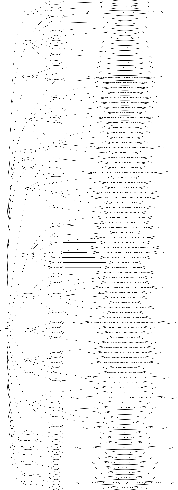

# AWS Launches Mindmap

This project is a command line tool to build a mindmap from recent AWS launch announcements. The output isn't that pretty for now and looks like this:

## Getting Started

Just clone this repo and pip install the requirements.

### Prerequisites

The python Graphviz library needs Graphviz installed in order to use the 'dot' tool.

